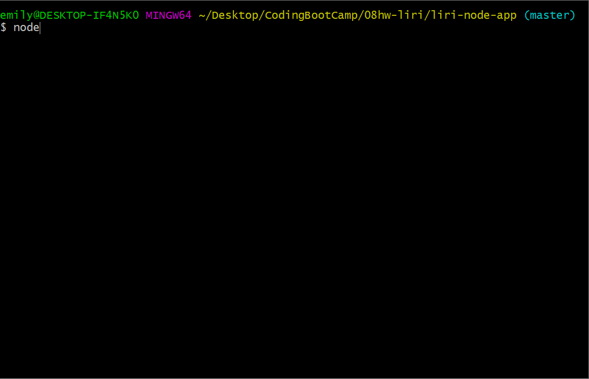
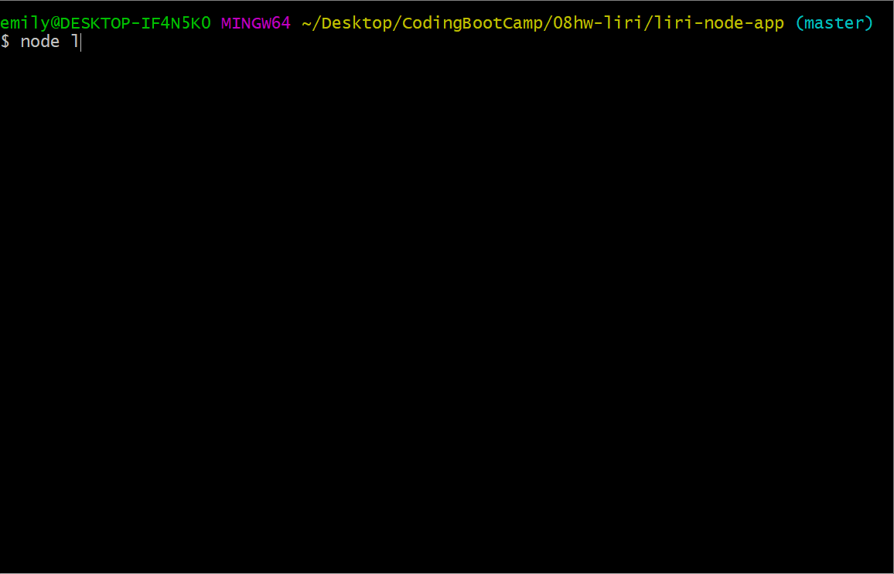
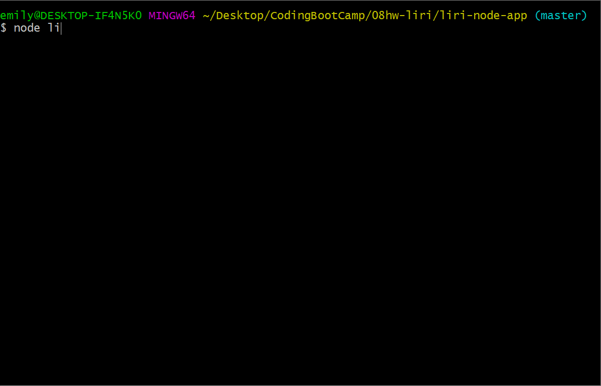

# liri-node-app

## What is this?

This a **Language Interpretation and Recognition Interface**. 

**LIRI** will be a command line node app that takes in parameters and gives the user back data.

### Commands

1.  **_node liri.js concert-this   'Artist or Band'_**

* The following information will be displayed when the user types the command above ...

  * Name of the venue
  * Venue location
  * Date of the Event 

Demo

1. **_node liri.js spotify-this-song 'song name'_**

* The following information will be displayed when the user types the command above ...

  * Artist(s)
  * The song's name
  * A preview link of the song from Spotify
  * The album that the song is from
  
Demo

1. **_node liri.js movie-this 'movie name'_**

* The following information will be displayed when the user types the command above ...

   * Title of the movie
   * Year the movie came out
   * IMDB Rating of the movie
   * Rotten Tomatoes Rating of the movie
   * Country where the movie was produced
   * Language of the movie
   * Plot of the movie
   * Actors in the movie

 Demo

1. **_node liri.js do-what-it-says_**

* When the user types the command above it will automatically show backstreet boys spotify..

